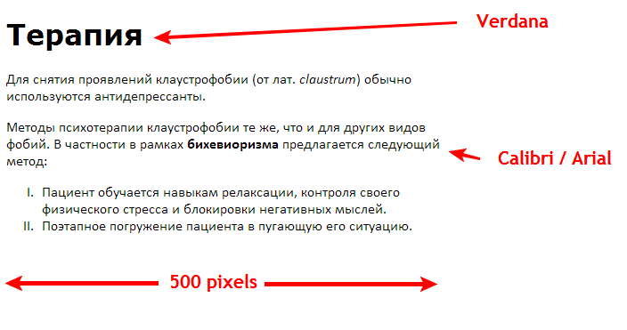
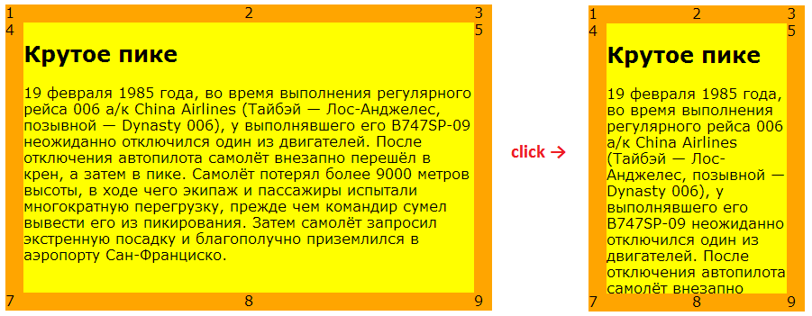
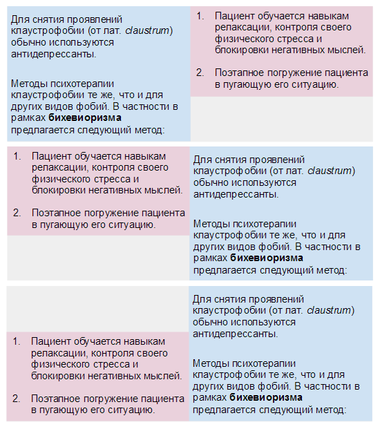
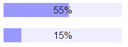
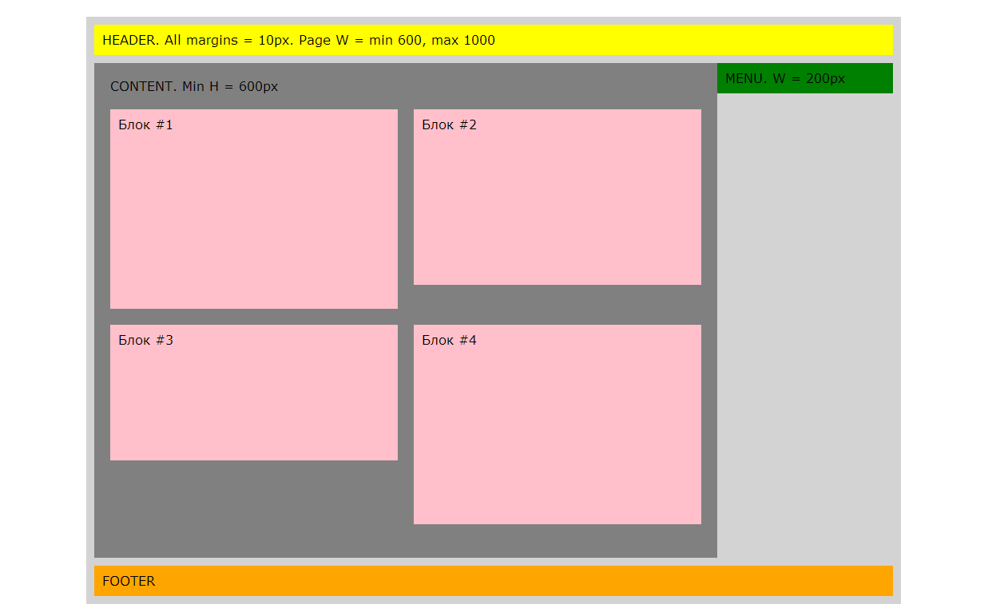

HTML и CSS
===

Теория
------

Вспоминаем основы HTML и CSS.

Задача 1
--------
Сверстать, правильно выбрав html-элементы основываясь на семантике.

[Текст можно взять тут](text.txt)

Задача 1а
----------
Сделать картинку фоном и добиться попиксельного совпадения текста с версткой в Хроме.
После этого попробовать добиться попиксельного совпадения в IE (не заботясь о Хроме). 

Теория
-------
Введение про [Reset.css](http://habrahabr.ru/post/45296/)

[Box model](http://www.w3.org/TR/CSS2/box.html)

[Модель визуального форматирования](http://www.umade.ru/resources/specifications/CSS2/visuren.html)

Использование средств разработки, встроенных в браузеры для отладки верстки.

При выполнении всех последующих заданий, результат должен себя правильно вести 
при изменении у самого внешнего элемента размеров, полей и отступов.

Задача 2
--------
Не меняя HTML написать стили так, чтобы страница выглядели (и вела себя при клике) вот так:

[Исходный Html](9grid.html)

Задача 3
--------
Сделать три варианта двухколоночной верстки так, чтобы html у всех трех вариантов был одинаковый.

Задача 4
--------
Сверстать прогресс-бар.

Задача 5
--------
Сверстать макет будущего сайта

Теория
------

http://caniuse.com/

Надстройки над CSS на примере [Less](http://lesscss.org/)

CSS-фреймворки на примере [Twitter Bootstrap](https://twitter.github.com/bootstrap/)

Минификация CSS и JS.

