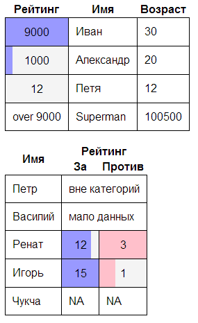
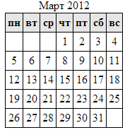

Javascript
==========

Теория
------
* Особенности JS, отличающие его от других языков.
* jQuery

Задача 1
--------
Сделать js метод, делающий из любой таблицы с числами визуализированную таблицу с числами, вот так:



1. Самостоятельно придумайте интерфейс метода и обсудите его с преподавателем.
2. Реализуйте метод, работающий без учета colspan и rowspan-ов.
3. Сделайте метод плагином к jQuery, чтобы его можно было использовать так: 
`$(".my-super-table").visualizeData(...);`
4. Придумайте какое-нибудь ещё усложнение по своему желанию :) 


Задача 2
--------

Создать календарь текущего месяца.


Календарь НЕ обязательно должен выглядеть именно так. Подключите фантацию :)

Пример использования:
```html
<div class="calendar"></div>
````
...
```javascript
var cal = new Calendar($(".calendar"));
cal.setDate(new Date());
cal.disable();
cal.enable();
var date = cal.getDate();
```
Делать по-порядку:

1. Отрисовка текущего месяца.
2. Возможность выделения мышкой какого-то дня.
3. Возможность получить и установить выделенную дату из js.
3. Возможность листать месяца мышкой.
4. Возможность листать года мышкой.
5. disable/enable из js.
6. Оформите это плагином к jQuery, чтобы календарь можно было делать так: `var cal = $(".cal").createCalendar(...)`
7. Придумайте ещё какое-нибудь усложнение по желанию :)


Теория
------
Ajax & JSON.

Handmade-шаблоны.

Задача 3
--------
1. Настроить IIS или любой другой HTTP Server на отдачу статики (в том числе .json файлов).
2. Создать json файл с каким-либо списком объектов.
3. Создать html, получающий json и рендерящий список с помощью js, на основе шаблона.


Теория
------
Руками шаблоны никто не делет. Для этого есть готовые мощные шаблонизаторы.
Циклы, ветвления, экранирование, иногда ещё и двусторонний дата-биндинг.

Промышленный шаблонизатор knockout.js — на домашнее освоение: http://learn.knockoutjs.com

И ещё один шаблонизатор [JsRender](https://github.com/BorisMoore/jsrender) другого типа.

Темы для самостоятельного более глубокого изучения
------------
1. http://learn.javascript.ru
2. http://learn.jquery.com
3. http://stackoverflow.com/questions/11246/best-resources-to-learn-javascript
4. Курс КРИПИ (следите за объявлениями в сентябре!) http://cripi.ru/#javascript
